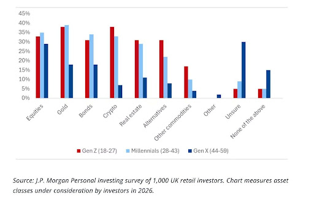
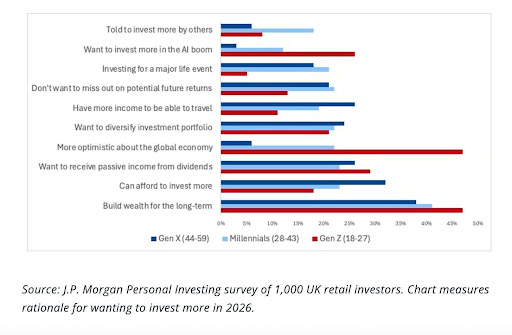

# Insurance On Anything

Critics of prediction markets rightly point out that they are largely just casinos right now. Supporters retort that they can be used for hedging. Occasionally, you'll see a coherent case for why an institution would find this valuable. But I've never seen a compelling case for why regular Joes would use this functionality.

In this article, I advance a plausible case for why. Uncertainty about the future has resulted in a generation that proactively seeks ways to reduce the risk of financial ruin. Hedging is the best mechanism for doing so, and prediction markets are the cleanest hedging tools ever created.

If a decision is one that carries risk, it is also one that can be hedged on a prediction market. This is a massive revelation for prediction markets. No longer is the TAM the upper bound of human gambling appetite. It is now the sum of human decision-making.

## Prelude

In 2022, I wrote ["Why Young People Are Into Crypto."](https://stovetop.substack.com/p/the-last-chance-why-young-people) The gist of that article was that life has gotten much more expensive, breaking the old "college and chill" path to wealth and prompting people to search for another way into prosperity. Crypto, investing, gambling, whatever you want to call it, was that other way.

I believe a portion of that thesis has been somewhat vindicated in the intervening 4 years. Memecoins were driven by the thrill of potentially achieving fuck you money, and Kalshi and Polymarket are now Unicorns, largely due to sports betting.

But, in another sense, I was wrong. The speculative energy this cycle never reached the fever pitch of 2020 and 2021. WIF and POPCAT went to billions, but they didn't sniff the heights of DOGE. Ordinals were worth $50,000. Bored Apes were worth millions.

I've spent a lot of time thinking about why, and I think I finally have an answer. Young people are not necessarily financially risk-averse, so they'll throw a bit of money into memecoins or Polymarket. But, they are ruin-averse, so they won't bet the complete farm on magical internet money.[^1]

In other words, young people care a lot more about not being broke than they do about being rich.

[^1]: DOGE and Bored Apes and the other bullshit that mooned in 2021 was due to COVID stimulus checks and the general money printer going brrr, not an especially high risk tolerance among users. Without that money printer, we got WIF and Ordinals.

## Financial Safetyism

I was blind to this reality for so long because I myself am not ruin-averse. If you are reading this, you are also very likely not ruin-averse. But we have to realize that we are the outliers here. The vast majority of people simply aren't risking their financial futures on startups, or memecoins, or UMA disputes. So, the first step to accepting this thesis is to step outside of our bubble and open our eyes.

The most commonly cited financial goal of young people is to build an emergency fund. 54% of Gen Z said, if given an extra $300, they would throw it right into savings, more than Millennials (44%), Gen X (40%), and even Boomers (45%). Gen Z spending declined even as it increased for Boomers. More than half of Gen Z are delaying major life decisions due to finances, just 25% prefer fast-paced career progressions with rapid promotions, and only 6% have achieving a leadership position as a career goal.

Unsurprisingly, their investment appetite also indicates ruin-aversion.

*Source: J.P. Morgan Personal Investing survey of 1,000 UK retail investors. Chart measures asset classes under consideration by investors in 2026.*

They are active investors, but they also strangely like conservative assets (bonds, gold, other commodities) more than other demographics. It only makes sense when you look at their goals.

*Source: J.P. Morgan Personal Investing survey of 1,000 UK retail investors. Chart measures rationale for wanting to invest more in 2026.*

The striking thing here is that Gen Z is least worried about missing out on potential future returns and most concerned with making sure they have some passive income and a nice nest egg.

That points to a demographic that is laser-focused on their financial futures. In other words: not being broke.

## But Why?

When my 2022 article was written, ChatGPT was not a thing yet. People vaguely knew about AI, but generally weren't concerned about a robot taking their job anytime soon. If you went to college planning to be a banker, consultant, or lawyer, sure, you might be crushed by debt when you graduate, but at least you could be reasonably sure that job would still be available.

That assumption no longer holds. If you are a college sophomore today, can you be sure that the lawyer or software engineer job you want will still be around in 5 years? Hell no. AI layoffs are already happening, and the technology isn't even that good yet. It doesn't mean we're all doomed to a life of destitution. New jobs will almost certainly appear. But, in the interim, the tried-and-true path is increasingly irrelevant.

This is why the hiring/firing rate and the quit rate are both in freefall. Nobody really knows what the future looks like anymore. In other words, there is now a persistent aura of uncertainty.

What do people do in times of uncertainty? They try to reclaim control. Hence, "go to college and chase your dreams" has shifted into "go to college, stay at home for as long as you can, and hold onto your job for dear life while plowing every dollar you can spare into the S&P 500."

This is a suboptimal situation on both the individual and societal levels. For individuals, constantly dealing with financial anxiety is not exactly mentally healthy. For society, if everyone is trying to avoid ruin, people make safer decisions than they otherwise would. They do not start the company. They do not move. They do not switch careers. They do not take the weird opportunity. As a whole, we become less dynamic.

## Prediction Markets Raise The Floor

A financial tool that protects against your downside risk is the natural solution. We already have such a tool: insurance.

But insurance is not scalable to each person's bespoke situations. What's the best way to proliferate a useful but slow financial mechanism? Make it into a market. Some of you might be saying "options!", and I agree that options are great when the risk maps cleanly to a traded financial asset. But that's largely not applicable to the average Joe's life. The everyman is worried about things like "Will the labor market in my specific industry be bad when I need a job?" or "Will my city's housing market fall after I buy?" Telling him to hedge by shorting oil futures is about as useful to him as thermodynamics.

Instead, I propose we use prediction markets.

Prediction markets are superior to options when the risk is an event, threshold, or real-world condition that does not have a natural underlying security. In other words, they transform the messiness of daily life into tradeable contracts. This mechanism lets you gamble on anything, but it also lets you hedge anything. Instead of trying to capitalize on an informational edge to turn a profit, you pay a known amount today to reduce the damage of a disaster tomorrow.

You won't profit from this. But you will avoid going to 0. For young people, that is extremely valuable.

### Example 1: Switching Jobs

Say you have a 25-year-old guy who is thinking about quitting his $180K banking job in NYC and moving to SF to work at a startup for $110K plus equity. He wants to do it, but he's worried about covering 6-9 months of rent to find a new job in the (likely) event this startup fails.

So he spends $5,000 and buys a basket of contracts that could pay $20,000–$40,000 if the bad labor-market scenario happens. A synthetic severance in a way.

| Hedge leg | Spend | Assumed YES price | Payout if true |
| --- | --- | --- | --- |
| U.S. tech layoffs exceed 75,000 in 2027 | $2,000 | $0.20 | $10,000 |
| SF software job postings fall 20% YoY | $1,500 | $0.25 | $6,000 |
| U.S. VC funding falls below $100B | $1,000 | $0.30 | $3,333 |
| 25–34 college-grad unemployment exceeds X% | $500 | $0.15 | $3,333 |
| **Total** | **$5,000** | — | **$22,666 max gross payout** |

If the tech labor market deteriorates, the basket covers his 6-9 months of rent. If it doesn't, he loses the premium, but likely keeps the upside of the career move.

### Example 2: Grad School

Now imagine you want to be a lawyer, but you're worried about wasting money and time on a job that might be completely done by AI by the time you graduate.

ABA reported that for the class of 2025, 87.7% of law grads had full-time, long-term Bar Admission Required/Anticipated or J.D. Advantage jobs about 10 months after graduation, so the hedge should be framed around deterioration from that baseline.

The goal is not to hedge the entire cost of law school. That would be too expensive. The goal is to protect one year of downside: loan payments, rent, bar expenses, and job-search time. Call it $40,000–$60,000.

So, you might spend $7,500 to hedge like this:

| Market | Spend | YES price | Payout |
| --- | --- | --- | --- |
| Law grad employment below 85% | $2,000 | $0.35 | $5,714 |
| Below 82% | $2,500 | $0.20 | $12,500 |
| Below 78% | $2,000 | $0.12 | $16,667 |
| Below 75% | $1,000 | $0.07 | $14,286 |
| **Total** | **$7,500** | — | **$49,167 max gross payout** |

### Example 3: Homebuyer

Say someone wants to buy a $600,000 home with 20% down, so they would need to put down $120,000. But, they are worried if they buy now and prices fall by 10%, they'll be stuck with negative equity or trapped in the house.

A 10% decline on a $600k home is $60k. So the hedge should aim to pay maybe $30k–$60k in a local housing downturn.

| Hedge leg | Spend | Assumed YES price | Payout if true |
| --- | --- | --- | --- |
| LA Case-Shiller index down 5%+ YoY by Dec. 2027 | $2,500 | $0.30 | $8,333 |
| LA Case-Shiller index down 10%+ from purchase date by Dec. 2028 | $2,000 | $0.18 | $11,111 |
| 30-year mortgage rate remains above 7% for 6+ months in 2027 | $1,500 | $0.25 | $6,000 |
| LA active housing inventory up 30%+ YoY by Dec. 2027 | $1,000 | $0.22 | $4,545 |
| National home sales below 4M annualized for 2 consecutive quarters | $1,000 | $0.20 | $5,000 |
| **Total** | **$8,000** | — | **$35,000 max gross payout** |

### Example 4: Founder

You want to quit your job and start a company, but, understandably, you are worried about the lack of financial stability. In particular, because you are building on the capital-intensive frontier, you are worried that the VC market completely goes to shit.

So, you need a hedge that gives you 12 months of runway if the funding market turns. Say the founder's personal burn is $6,000/month. They want 12 months of protection, so $72,000.

| Market | Spend | YES price | Payout |
| --- | --- | --- | --- |
| U.S. seed deal count down 15%+ YoY | $2,000 | $0.35 | $5,714 |
| Down 30%+ YoY | $3,000 | $0.20 | $15,000 |
| Down 45%+ YoY | $3,000 | $0.12 | $25,000 |
| Down 60%+ YoY | $2,000 | $0.06 | $33,333 |
| **Total** | **$10,000** | — | **$79,047 max gross payout** |

One note on all four tables: the totals are *maximum* gross payouts, which assume every leg resolves YES. The legs are correlated but not identical, so a realistic bad scenario pays out some subset of the basket. In Example 4, if only the first two legs hit, the payout is $20,714 against a $72,000 runway need, not $79,047. Size the basket around the partial outcome you actually expect, not the ceiling.

## Objections

The natural objections to these examples are liquidity, basis risk, and complexity.

Liquidity is tough. The core assumption here is that prediction market traders don't only trade markets that they have a personal interest in. They trade markets where they can make money. Do you think it's a completely different set of people who trade Iran, Ukraine, Trump dancing, box office returns, AI model ratings, and which characters will die on Euphoria? No, it's not. It's the same people over and over again. If there's potential for profit, traders will get involved.

But this future involves many, many markets. You'll need market makers, arbitrageurs, and basis traders willing to quote prices across thousands of related risks. If every hedge ties up fully collateralized capital until resolution, the long tail stays too expensive and too illiquid to matter. This is why we need a credit layer like Lattica and the superior capital efficiency it offers.

It is also possible that this is a two-way street. As our 25-year-old is moving to SF to pursue a tech career, another 27-year-old might be moving to NYC to pursue a banking career. He could then be the counterparty to our protagonist, providing the liquidity needed to make the trade.

Basis risk is the risk that a hedging strategy fails to offset the underlying exposure. In our example, it would look like buying YES on SF tech job postings falling 20%, it only falls 17%, and our hero loses his job. In that case, he's lost both his job and his hedge, a disastrous outcome.

This might never be fully eliminated, but it can be managed. The natural solution is to use a more granular market. So, something like "Will [Startup X] terminate, lay off, or furlough 20%+ of employees before Jan. 1, 2028?", but liquidity is likely to be a problem here. That makes using a basket, as we did in the examples, the best workaround, as it minimizes the risk of a single proxy missing.

This segues nicely into the final objection: complexity. Would anyone ever go through the pain of actually figuring out how to hedge their financial risks? It's a fair question. Again, our main mental model here is that young people want to avoid uncertainty. Trying to create a basket of hedges is about the furthest thing from "S&P 500 and Chill."

AI might provide a solution here. Given your unique situation, a sufficiently powerful AI assistant could tell you exactly what your hedges should be. Hell, it can probably even buy and manage your positions directly.

So, I would go to my AI, tell it exactly what I want to do and what I'm worried about, and it would go to a prediction market, make the trade for me, and constantly adjust my positions as my circumstances change. A wealthfront for my own personal risks.[^2]

[^2]: Coincidentally, this would also improve liquidity. The easier something is to buy, the more likely people are to buy it.

You might be thinking that this is all too speculative and unrealistic. That people would never behave like this. I find that type of thinking very narrow-minded. For one, people blindly ape index funds into their 401(k) every day, and they do so to ensure they can retire. Why wouldn't people buy hedges that ensure they won't be homeless if they take a new job?

Second, tech always seems ridiculous beforehand. 50 years ago, would people have ever thought that we would manage all our finances online? Or that we find our spouses on an app on a touchscreen mini computer? Or that "influencer" and "OnlyFans model" would be lucrative careers? Of course not.

The interesting question for tech is never "is this viable?" It's "what changes if it is?" In this case, the answer is a complete shift in the mindset of an entire generation. The future would no longer be an anxiety-inducing, uncertain black box. It'd be a world in which every door is open because the floor has been raised.

You could buy a house without worrying about the housing market. You could switch or quit jobs without worrying about the labor market. You could go to grad school without worrying about whether AI will make you obsolete.

You'd be free because you'd have certainty that you won't end in ruin, and, as a result, society as a whole would benefit from a more dynamic, risk-taking populace.

## Insurance On Anything

Relying on prediction markets to scale as a casino is untenable. Pure gambling narratives are fragile. They depend on a constant supply of users willing to lose money for entertainment. Eventually, people will run out of money and the market will dry up (see memecoins), or regulators will say enough is enough and strangle the market.

For prediction markets to reach their lofty aspirations, they need a positive-sum use case. I believe hedging uncertainty is that use case. The narrative writes itself. Losing money on a good hedge is not automatically a "loss." It may simply mean you avoided the risk you were scared of. Thus, even a lost bet on a prediction market can be a winner in reality. What is more positive sum than that?

In many ways, this is the original narrative of crypto itself. Bitcoin was a response to an uncertain financial system. The government can't rob you through inflation or outright force when code is law. It's the same for gold. There's a reason why people buy gold when they think everything is going to shit.

Prediction markets can and should make similar claims of providing certainty in an uncertain world.

So, let's change the meaning of "trade on anything" from "gamble on bullshit" to "get insurance on anything." This is a much more attractive narrative for the users we'll need to ensure prediction markets are sustainable in the long term.
