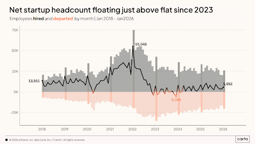
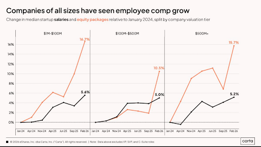

# Prediction Markets Are THE Place To Build

AI has fundamentally changed how companies hire. Having a genius in your phone means you need fewer people:

But the few people you do hire are cracked and very well compensated.

The consequence of this is that desirable engineers, designers, product managers, and marketers have their pick of the litter when it comes to job offers. My goal here is to make the case for why, if you're one such desirable person, you should look to work in prediction markets.

## Big and Growing…But Early

In June 2024, Polymarket did $100M in volume. Kalshi's [US vs Belgium market did $260M in volume alone](https://deadspin.com/prediction-markets/trending/more-than-260m-traded-on-kalshi-for-usmnt-vs-belgium-world-cup-match/). Prediction markets now have [$2B of open interest and $50B of monthly volume](https://predictions.paradigm.xyz/?basis=volume&start=2026-06-07&end=2026-07-07), a 500x increase in just two years. Kalshi is raising at a $40B valuation; Polymarket $15B. Major market makers like SIG and Citadel are now actively involved. ICE, the parent company of the NYSE, is investing up to $2B directly into Polymarket. [Seven new Designated Contract Markets were approved in 2025](https://ufoholdings.substack.com/p/regulatory-greenfield), with dozens more pending. It's just remarkable growth for something that was considered a nerd pipedream just three years ago.

But, despite this rapid growth, prediction markets are still in the early innings. Frankly, the product is not yet a good one. The entire market is still spot-only, resulting in poor capital efficiency, capped potential profits, and constrained liquidity. Likewise, prediction markets also remain quite toxic for market makers due to latency and the risk of informed traders, further contributing to poor liquidity and a subpar trading experience.

Derivatives, prop firms, prime brokerages, leverage, lending and borrowing, portfolio margin, and standardized contracts still either don't exist or are in the very early stages. These are the primitives we need to transition from a glorified sportsbook to an institutional trading and risk-transfer platform.

The point is, there's still a lot of room to run here. Prediction markets right now are like LeBron James at four years old. For comparison's sake, the introduction of credit and margin to DeFi led to a 148x increase in trading volumes. The path to a trillion-dollar market is clear, and owning any of those aforementioned primitives would be a unicorn outcome in itself.

## Not Just Gambling

Let me (hurl) double-click on the earliness of prediction markets. It's often said that prediction markets are just sportsbooks, and right now that's valid. But that doesn't have to be, and I think won't be, true for very much longer.

Obviously, they are forecasting tools and are likely the best such tools mankind has ever created. This leads to uses in [politics](https://freesystems.substack.com/p/inside-the-markets-aggregating-political), media, [macroeconomics](https://www.federalreserve.gov/econres/feds/kalshi-and-the-rise-of-macro-markets.htm), and even [a new form of governance itself](https://mason.gmu.edu/~rhanson/futarchy.html).

Beyond forecasting, they are also extremely useful for hedging risks. That makes them apt for institutional risk transfer like the [$65B catastrophe bond market](https://medium.com/@benedictaltier/prediction-markets-are-coming-to-insurance-heres-how-to-prepare-9f0b412386dc), but also for more granular risks that average Joes face, like "Is going to Law School worth it with AGI around the corner?" I articulated that case [here](https://x.com/SteveFlanders22/status/2066894978643599643), but the gist is that prediction markets can be the cure for virtually all forms of anxiety from financial uncertainty, enabling people to chase their dreams free of worry.

Sports are the current meta because of the structural limitations of prediction markets. People already like sports, they don't have to worry about getting rule-cucked, and market makers can quote relatively free of adverse flow. As new primitives (like [@LatticaFinance](https://lattica.finance/)) come into play and the ecosystem matures, the evolution into a more sustainable and frankly more societally useful market is inevitable. The key for you is being early to that metamorphosis.

## Still Nonconsensus

I want to be careful here, because there are smart people and teams working on and in prediction markets. But, to be honest, the competitive landscape is still nowhere near as saturated as it is in, for example, AI.

I think there are a few reasons for that. Many still see prediction markets through the "this is just gambling" lens. Others affiliate it with crypto, which is not exactly the darling of the tech scene right now. And others might just want to chase AI because it's so hot.

We've already addressed the "this is just gambling" objection. Regarding its affiliation with crypto, I don't want to spend too much time on it because if crypto still icks you out in 2026 then there's likely very little I can say to change your mind. But, for the sake of argument, I'll make three points. First, many in the prediction market community openly denounce any link between prediction markets and crypto, and the largest prediction market exchange has little to no connection to crypto. Second, the lines between "crypto" and "traditional finance" are becoming increasingly blurred. Third, crypto makes possible many of the innovations that prediction markets need to scale.

Now that we've smoothed those two problems over, let's focus on the allure of other hot markets, like AI. I understand the appeal of chasing consensus; I really do. But let's be honest here: unless you're working in a frontier lab, your contribution to AI at this point is next to nothing. How many AI coding agents, CRMs, marketing platforms, legal assistants, and tutors do we need?

That market is saturated, brother. So far, in YC's Summer 2026 batch, 40 out of 59 companies had the word "AI" in it. A grand total of 0 had "prediction" or "crypto" in it.

I am not saying you can't be successful working in AI. But, the reality is you will be in a death race upstream with every other jabroni in the world. You might be one of the lucky few who claw their way to the promised land, but wouldn't it be so much easier to get to the same destination via a fucking tsunami instead?

*Margin Call* is a movie with endless quotable lines, but my favorite is this:

> "There are three ways to make a living in this business: be first, be smarter, or cheat. Well, I don't cheat. And although I like to think we have some pretty smart people in this building, **it sure is a hell of a lot easier to just be first**."

The generational businesses you envy today exemplify this quote. Take Coinbase. There were undoubtedly countless people with the technical chops to build Coinbase in the early days. But crypto was a "scam" not to be taken seriously back then. Only Brian actually recognized the opportunity and went for it. Obviously he's razor sharp, but he also had the benefit of being early to a fucking tsunami.

Chasing the consensus largely leads to consensus results. If you really want to leave your mark on the world, you have to deviate from the crowd. AI is the hive mind. Prediction markets are the thing a small number of [smart people are doing on the weekend.](https://cdixon.org/2013/03/02/what-the-smartest-people-do-on-the-weekend-is-what-everyone-else-will-do-during-the-week-in-ten-years/)

The millionth Claude wrapper doesn't add much value to the world and, in my opinion, is really freaking boring. Designing a whole new financial system around an instrument that is both inherently truth-seeking and also the worst collateral asset ever created? Now that's exciting. There aren't many, if any, other fields where you can [produce as much positive value](https://x.com/metaproph3t/status/2060407732344435037), have a higher chance of succeeding, and scratch your intellectual itches as prediction markets. Then, after you changed the world and made your money, you can go back to AI from a position of strength. It's not like AI is going anywhere.

## Wrapping Up

I am admittedly not an unbiased narrator. I'm building a [PM startup](https://lattica.finance/) myself and hiring engineers and marketers (DM me!), so I would love it if more smart people joined the party. However, believe it or not, that's not my main motivation here. My real goal is to save people from the pain of being a sheep.

Too many talented people waste their God-given abilities on shit that doesn't need them. I can understand why a smart person with a low risk tolerance is drawn to banking or consulting. But, what I can't understand is why a smart person who has already chosen the riskier path of startups would follow the herd into AI. I know your passion isn't AI agents for construction companies. So, why are you building that when there's a fucking white whale right in front of your face?

The new world is there for the taking, brothers and sisters. Dive in while the water is warm.
