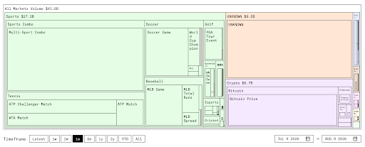
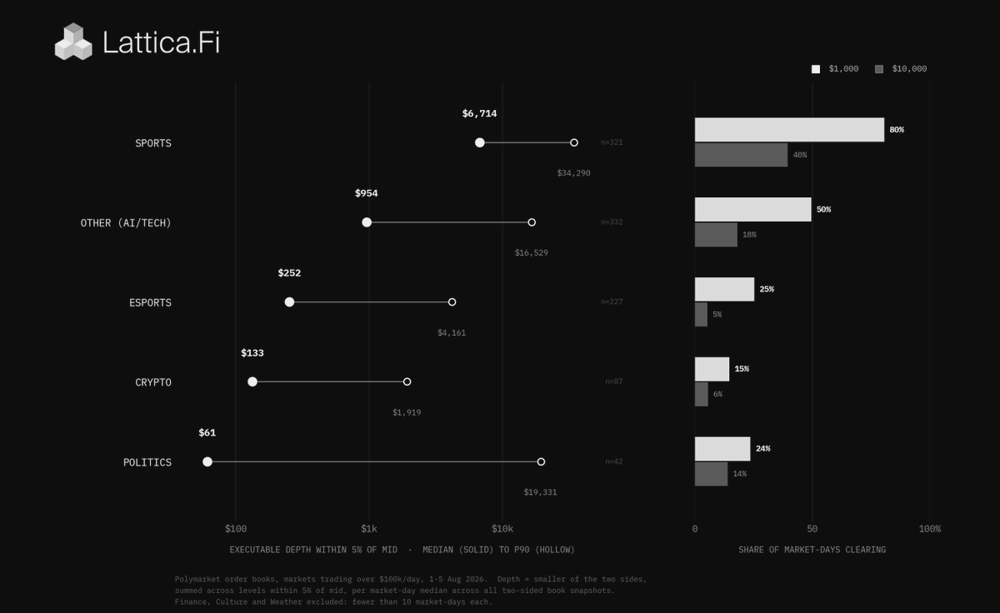
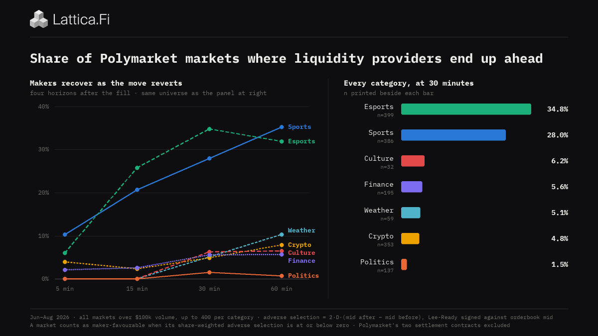
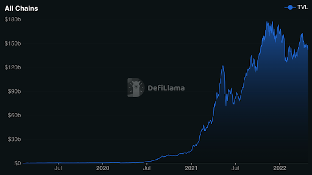

# Prediction Markets Need Liquidity First, Everything Else Later

Prediction markets are now a big market. It's hard to call a market doing [$40B in monthly volume](https://predictions.paradigm.xyz/?basis=volume&start=2026-07-09&end=2026-08-09) anything else. They are also, unironically, still early, as the only products that are used at any significant scale are the exchanges themselves. Accordingly, a wave of builders has descended into the space to build the products that every other market has, like terminals, aggregators, indices, and options, along with native products, like distribution markets, impact markets, and permissionless markets.

I deeply respect all of the builders in the space, and I applaud all of their attempts to improve the truth oracle we love so much. However, none of them address the core problem that plagues prediction markets: poor liquidity. Until liquidity is improved, every product will run up against a ceiling. It is a lot easier to take a piece out of a pie when the pie is absolutely massive.

As such, the only things that matter for PMs in the short-to-medium run are enabling credit and building a new microstructure.

## Sports Supremacy

As I said, PMs are a big market. $43B in monthly volume is almost [25% of the size of total DEX monthly volume](https://defillama.com/?dexsVolume=true&groupBy=monthly) in traditional crypto. Yet, PMs only have $1B in OI, while crypto has $75B in TVL. Why the discrepancy?

Because the vast majority of volume is in sports and crypto, also known as markets with very short times to resolution. Because those markets turn over so fast, you naturally won't have nearly as much open interest compared to DeFi where people have billions HODLing in Aave and related platforms.

There is nothing inherently wrong with this, but a sportsbook and 5-minute Bitcoin casino is not the vision we were all really looking for. So, it is then worth asking why people are gravitating toward sports.

Obviously, people enjoy betting on sports, and they think they can actually win on sports. But, structurally, sports also has advantages. Mainly, it is by far the most liquid market category.

This liquidity is crucial to the popularity of sports "predicting." People can actually easily get size down on their positions. There's nowhere else you can do that on Polymarket, and it hamstrings the growth of the other markets.

So, why are sports so liquid? The common answer is that it's simply the thing most people want to bet, and liquidity begets liquidity. There is truth to that, but I believe the answer is a bit more nuanced.

Any market is two-sided. You have makers placing asks and takers making bids. Sports has a lot of natural bidders, but that only explains half the market. You still need makers to place bids for those bidders to buy. Sports has that in droves because it is among the friendliest markets to market make on the platform.

The chart above shows that a much higher percentage of sports and esports markets have prices that move in favor of market makers after an order is filled. So, if a maker's ask is filled at 50c, it's much more likely that a sports market will trend down rather than trend up.

Basically, there is very minimal extreme toxic flow in sports, which passes the smell test. Absent a player intentionally throwing their stats, what "inside info" can there be? Although there are sport sharps who take the MMs to the woodshed (especially since they can't ban/restrict them as traditional sportsbooks do), there is enough uninformed flow to profit.

Besides being friendly to market makers, sports are also, in a strange way, the superior play for capital efficiency. Sports bets are short-term. A day or less usually for a game, sometimes much less if you are betting in-game. Most other categories of markets, especially the liquid ones, are long-term. The 2028 Presidential Election is liquid, but you have to hold your position for up to two years to profit.

That proposition is simply not attractive in a world where you can hold a traditional investment position like equities and profit with much more certainty. It's also not attractive if you have high risk tolerance. In that case, you're better off trying your luck onchain or on sports.

Likewise, it's much tougher to market make on the other market categories. Toxic flow is a real thing in politics, tech, culture, and finance, and there isn't enough uninformed demand to offset it.

Thus, sports are the only truly liquid market.

For Polymarket to become liquid throughout, we need to emulate the forces at work in sports. So, you need to make it easier for makers to market-make and more attractive for traders to actually get involved.

In other words, you need credit for the demand side and new microstructure for the supply side.

## Credit

The foundational primitives of finance are enforceable contract/property rights, accounting, some unit of account, and credit. Polymarket has three of them (thank you Polygon and PUSD), but it lacks credit.

Credit is the ability to get money now with the promise to pay (with a little on top) later, and it allows people to trade the time value of their assets. Somebody with surplus assets they can't use can now loan it out at a fee to someone who can use it. The result is the creation of non-zero-sum wealth.

It is credit that forms the foundation of our modern financial system, and it is credit that took DeFi from obscurity to prominence. Take a guess when Compound and Aave really started taking off.

I believe credit can have a similar impact on Polymarket, and I believe it not just because of 4,000 years of history, but because it neutralizes one of the largest deterrents toward taking non-sports bets: long lock-ups.

Take the market *Which party will win the house in 2026?*. If you have very high conviction that it will be the Democrats, you now have to fork over your money until Nov 3rd for a maximum 11% reward. That's not very enticing when you can fire up the Fomo or Pump app for a moonshot or trade sports and potentially double your money in a few hours.

What credit allows you to do is borrow against your position. So, you can act on your very high conviction Democrat prediction for let's say $10,000, borrow against it and receive $7,500, and now you have $7,500 to make more money. You can throw that $7,500 into a yield farm, take other trades, or even double down on your existing position. Suddenly that 11% return can now be much higher.

This has two positive effects on liquidity. First, and most obvious, it lets people take long-term trades they otherwise wouldn't. And if that midterm trade no longer means watching paint dry for three months for the possibility of scraps, it's very likely more people will take that trade.

Second, it allows for capital to proliferate throughout that exchange. If I take a $10,000 bet on the Democrats and then borrow $7,500 against my shares, what do you think I am going to do with my newfound wealth? Probably take more prediction market positions.

Simply put, credit enhances demand. That demand then leads to a more liquid market, which makes it easier for new participants to enter, which further improves liquidity, and on and on it goes. It's a positive flywheel that prediction markets currently lack.

Nothing I am saying here is news. Everyone basically knows that credit would help boost liquidity. The problem is that enabling credit on prediction markets is really freaking difficult. Prediction market positions are a strong contender for the worst pieces of lending collateral ever invented, as they are extremely "jumpy." A position that looks safe right now can jump to 0 in an instant with virtually no prior warning. That is in stark contrast to something like ETH that exhibits a relatively smooth price trajectory.

There have been some who have tried to solve this problem, but, to date, they have all failed. This is not the article to go into detail on why they failed (I'll do that another day), but the gist is they all relied on liquidations for solvency, a silly strategy for an asset class that violently gaps up and down. To enable credit on this novel asset class, we need a similarly novel approach, not "fork Morpho and pray."

This is the thesis behind [Lattica](https://lattica.finance/). Jump risk is addressed through similar methods that actuaries have been using to price insurance for centuries. The expected shortfall of a position over a given period of time is forecasted, calculated, and charged to the trader as an upfront premium. The result is that solvency is ensured at loan origination. Proceeds from liquidation are an added bonus, not operationally critical. A full breakdown can be found in our [two whitepapers](https://lattica.finance/whitepapers).

Our motivation and goal for building Lattica was to bootstrap the demand prediction markets need to become the largest market on Earth. But, our success only solves half the problem. Microstructure must also be renovated.

## Microstructure

Prediction markets use a Continuous Limit Order Book (CLOB). What that means is the exchange is continuously matching trades using a price-time priority rule, meaning the best prices and earliest submission times execute first.

The CLOB presents two problems for prediction market market makers.

First, it weights too heavily toward speed. A quick trader can sweep the books on news faster than market makers can update their prices, leading to huge losses. As [Sybilpm puts it on Substack](https://sybilpm.substack.com/p/the-snipers-tax):

> Polymarket and Kalshi solved the hard v1 problems: getting users, staying legal, and building trust. Existential stuff. **But the market structure was inherited from traditional finance without much questioning of whether it fits.** Traditional stock exchanges use continuous limit order books, and so does Polymarket.
>
> The problem is that prediction market assets are binary and news-sensitive in a way that stocks aren't. Apple might gap down 3% on bad earnings. A "will there be a strike today" contract goes from 10 cents to 99 cents in the time it takes to read a tweet. **In traditional markets, being slightly slower than the fastest trader costs you a few basis points. In prediction markets, it costs you the entire value of your position. This is bad for market makers.**
>
> **There is a known fix for this problem. It's called a batch auction.**

As Sybil says, batch auctions are an elegant solution to the speed problem. By batching orders collected in a given timeframe into one clearing price, the market switches from a speed competition to a price competition, removing the threat of stale quotes being picked off on fresh news. For the sake of time, I'll end that discussion here, but, if this is of interest to you, Jump's Dual Flow Batch Auction is [basically required reading](https://jumpcrypto.com/resources/dual-flow-batch-auction).

However, batch auctions don't address the second problem: informed flow. Market makers make money on the spread (which comes mostly from squares/uninformed flow) and lose money when they're wrong on the price (so, to sharps/informed flow). In other words, the natural order of things is:

- Squares lose money to market makers and sharps.
- Market makers make money on squares and lose money to sharps.
- Sharps make money on both.

Thus, even without a speed advantage, a trader with better information than the market maker can still cause losses as he can simply price the market better. Have enough of these traders and market making can be unviable. As the data earlier showed, the vast majority of markets are in or approaching "unviable" territory.

This is a tougher problem to solve, as informed flow is kind of the point of prediction markets, isn't it? It wouldn't feel right to take the sportsbook approach and restrict good traders. At that point, you would lose the informational positive externality that draws many people to prediction markets in the first place. Improved demand from credit might be able to help by freeing up square money, but, it also frees up sharp money, so this is likely a wash at best.

I have a very smart friend working on a paper that addresses this problem, so I won't say anything further as to not spoil his work. The only thing I will say for now is that this problem needs to be solved if prediction markets are ever to reach their full potential.

## Growing The Pie

I am optimistic that prediction markets today are as unliquid as they will ever be. Credit enabled by Lattica will bootstrap demand. Microstructure improvements will liberate market makers. Various other improvements to UI/UX, rule writing and resolution, and regulations will make it easier and safe to trade. It is only up from here, and on that way up, other primitives can begin to also materialize, leading to a more mature and better market for all. Eventually, with enough liquidity, prediction markets can even become the [ultimate insurance tool I believe it was destined to be.](https://x.com/SteveFlanders22/status/2066894978643599643)

But none of this can happen without adequate liquidity. Liquidity is the lifeblood of a market. With it, we can all ride a great tide upward. Without it, we are all fighting for the last chopper out of Saigon.

Nothing else matters right now.
